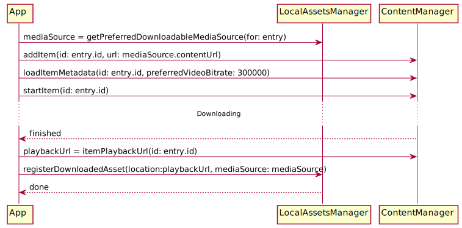
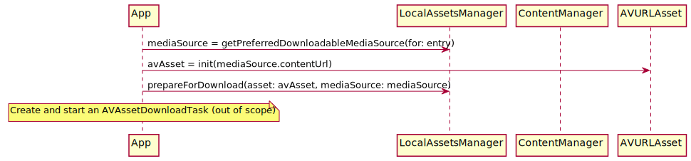

# Download

The PlayKit component responsible for local/offline/downloaded assets is `LocalAssetsManager`.  

## Select a source to download

A `PKMediaEntry` typically has more than one PKMediaSource, so the first step is selecting the most suitable source.
Call `LocalAssetsManager.getPreferredDownloadableMediaSource(for:)`, passing a PKMediaEntry. It will try to find a downloadable 
source.

There are two mechanisms for downloading HLS assets: Kaltura's DownloadToGo (DTG) library and Apple's `AVAssetDownloadTask`. 
In most cases, **DTG** should be used. The only case in which `AVAssetDownloadTask` must be used, is when downloading **FairPlay** on iOS 10.0-10.2. 

> NOTE: We recommend that apps restrict FairPlay downloads to iOS 10.3 and up, with **DTG**

## Use DTG to download HLS assets

DTG has [its own documentation](https://kaltura.github.io/playkit-ios-dtg/), please look there for a guide. Also see the Example app in its repository.

This flow works for clear and AES HLS assets on iOS 8 and up. It also works for FairPlay assets on iOS 10.3 and up.

> NOTE: If the asset is FairPlay-protected, the master playlist must contain a EXT-X-SESSION-KEY tag with the asset's `skd` URL. Without it, LocalAssetsManager won't be able to install a FairPlay license.

## Use AVAssetDownloadTask to download FairPlay assets on iOS 10.0 to 10.2

See PlayKit's [OfflineSample](https://github.com/kaltura/playkit-ios-samples/tree/develop/OfflineSampleSwift) and Apple's [HLSCatalog](https://developer.apple.com/library/content/samplecode/HLSCatalog/Introduction/Intro.html) for help with using AVAssetDownloadTask.

# Playback

Call `LocalAssetsManager.createLocalMediaEntry(for:localURL:)`, returns a PKMediaEntry ready to play. 

